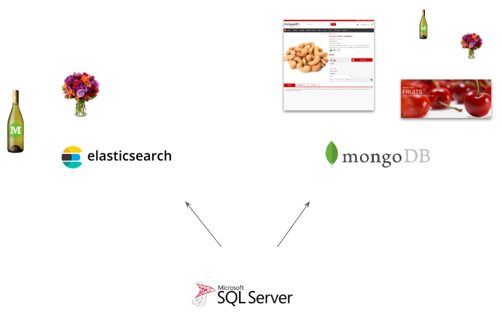

# Managing Derived Data (MongoDB and ElasticSearch)

Znode persists data to a Elasticsearch, MongoDB, and SQL Server databases. The SQL Server database is the system of record for everything, with the Elasticsearch and MongoDB data being derived from the SQL data.

It can be helpful for developers to know more details about this flow of data, especially if working on customizations to backend behavior.

## Publishing Data

The following diagram shows how the system of record, data in SQL, derives the product data indexed in Elasticsearch, and the content and product data in MongoDB.

This act of triggering data flow from SQL to the downstream databases is known as 'Publishing' in Znode. Publishing a store can be invoked at any time from the Admin UI on the `Stores & Reps` > `Stores` page by clicking the globe icon for the desired store.

## Rebuilding Derived Data

When investigating issues, it can be helpful to delete and rebuild data stored in MongoDB and Elasticsearch. To do so, follow these steps:

### Step 1: Delete Elasticsearch Indices

The Elasticsearch index should be deleted.

1. Send an HTTP DELETE request to Elasticsearch. For example `DELETE http://localhost:9200/finefoodindex`.

See the dedicated [Elasticsearch documentation page](/docs/data-management/elasticsearch/README.md) for more information about deleting indices.

### Step 2: Delete MongoDB Databases

The MongoDB database(s) should be deleted.

1. Install [NoSQLBooster](https://nosqlbooster.com/home).
1. Once connected to the MongoDB server, right click the database to be deleted.
1. From the contextual menu that opens, select the `Drop Database...` option.
1. The query editor window will automatically populate with a snippet. Run the snippet to perform the deletion.
1. Repeat process for second MongoDB database that holds logs, if clearing the logs is desired.

### Step 3: Re-create Elasticsearch Index

The next step is to re-create the Elasticsearch index.

1. Go to the `Marketing` > `Site Search` page of the Admin UI.
1. Select the desired catalog in the `Catalog` field.
1. Click `Create Index` to create the new empty index.

Note: This step is optional. This step can be safely skipped because Znode will automatically create the index if necessary when triggering the publish in the next step.

### Step 4: Re-publish Store

The final step is to re-publish the entire store.

1. In the Admin UI, go to `Stores & Reps` > `Stores`.
1. Click the globe icon for the store to publish.
1. Progress bars will show the progress of the publish operation.
