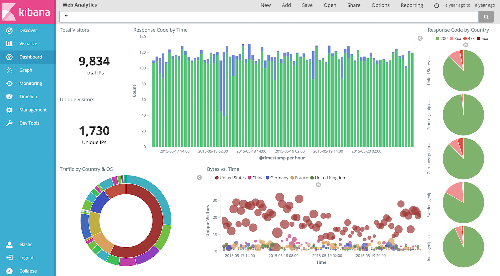

# Elasticsearch In-depth

Search functionality in the Znode WebStore is built on top of Elasticsearch. Each catalog in Znode is published to Elasticsearch as a single independent Elasticsearch index.

As a Znode developer, it's typically unnecessary to directly interact with Elasticsearch. However, it's helpful to understand a few simple Elasticsearch commands that can be useful during development.

## Elasticsearch Configuration

The ElasticSearch server to which Znode points is configured in the API's web.config. More detail about the `ElasticSearchRootUri` setting is [here](/docs/configuration/README.md).

ElasticSearch *index name* configuration is stored in the SQL database. More detail about Elasticsearch index names is [here](docs/multi-environment/README.md).

## Elasticsearch API

Elasticsearch itself provides access to all of its functionality via its built-in RESTful API that is automatically available on any installation. By default, this API is hosted on port 9200 of the machine it is installed on.

It's possible to verify that Elasticsearch is running properly, by simply sending a GET request to the root of the Elasticsearch API. Quite simply, navigating to http://localhost:9200/ in a browser will send this request and show the result. The result should be something like the following:

```JSON
{
  "name" : "P3P2KCW",
  "cluster_name" : "elasticsearch",
  "cluster_uuid" : "ukx1MiuOJRE6nXOzICPGeg",
  "version" : {
    "number" : "5.5.0",
    "build_hash" : "269487d",
    "build_date" : "2017-06-30T23:16:05.735Z",
    "build_snapshot" : false,
    "lucene_version" : "6.6.0"
  },
  "tagline" : "You Know, for Search"
}
```

## Listing All Indices

A summary of all Elasticsearch indices can be viewed by loading the following URL in a browser: http://localhost:9200/_cat/indices?v. The result will look something like the following:

```JSON
health status index                uuid                   pri rep docs.count docs.deleted store.size pri.store.size
yellow open   carsuppliesindex     Yz2zOC-8R8yP3DadpBGfpQ   5   1        129            0    101.4kb        101.4kb
yellow open   finefoodindex        fXKyiPu3R6y1sYXCRajX0Q   5   1        448            0      3.8mb          3.8mb
```
This example shows that there are 2 indices, corresponding to 2 different catalogs in Znode. The `docs.count` and other properties will grow as more products are added to the catalog and published.

See [List All Indices](https://www.elastic.co/guide/en/elasticsearch/reference/5.5/_list_all_indices.html) in Elasticsearch's official documentation for more info.

## Deleting Indices

Under normal circumstances, it is not necessary to rebuild indices in Elasticsearch. However, it can be helpful during development, when diagnosing functional/performance issues or migrating data between environments.

Like many Elasticsearch operations, _deleting_ an index is as simple as sending an HTTP request to the Elasticsearch REST API. An HTTP DELETE request must be sent to the URL http://localhost:9200/{index_name} where `{index_name}` must be replaced with the name of the index to delete. For example, to delete the index for the `CarSupplies` catalog, a DELETE request must be sent to http://localhost:9200/carsuppliesindex.

See [Delete Index](https://www.elastic.co/guide/en/elasticsearch/reference/5.5/indices-delete-index.html) in Elasticsearch's official documentation for more info about deleting an index.

## ElasticHQ for Advanced Elasticsearch Management

An advanced, open source, Elasticsearch monitoring and management tool can be easily installed on a development machine to make advanced tasks easier. The tool is called [ElasticHQ](https://github.com/ElasticHQ/elasticsearch-HQ).

## Kibana for Elasticsearch Data Visualization

An official, open source, Elasticsearch visualization tool can be easily installed to make it easier to audit/understand the data held in Elasticsearch. The tool is called [Kibana](https://www.elastic.co/products/kibana).

Here is an example of a Kibana dashboard built to visualize timing data:



## Official Elasticsearch Documentation

Official full documentation for Znode's version of Elasticsearch, v5.5, is available on Elastic's website [here](https://www.elastic.co/guide/en/elasticsearch/reference/5.5/index.html).