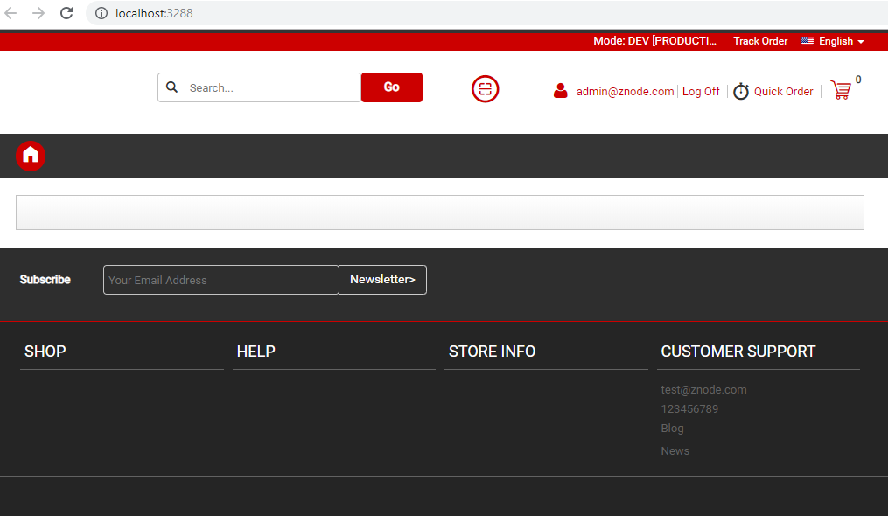

# Installing Znode
These instructions help with Znode setup from start to finish. The instructions are divided into the following parts:
* Part 1: Getting the Znode Code
* Part 2: Creating a Znode Database
* Part 3: Installing Web Compiler
* Part 4: Configuring NuGet
* Part 5: Configuring, Building and Running Znode
* Part 6: Exploring Znode

It is assumed that Znode's dependencies are already installed. If that's not the case, start by [Installing Znode Dependencies](../installing-dependencies/README.md) first.

## Part 1: Getting the Znode Code
It is assumed that [Git](https://git-scm.com/) is already installed. See Git's [official installation guide](https://git-scm.com/book/en/v2/Getting-Started-Installing-Git) if necessary.

Run the `clone` command at a Git Bash window:

`git clone https://github.com/amlacommerce/znode.git`

If prompted to do so, provide your GitHub credentials.

## Part 2: Creating a Znode Database
DB [create scripts](https://github.com/amlacommerce/znode/tree/master/ZnodeMultifront/Database) are kept in the repository to enable easy creation of a new database.

There is a 'create script' within each of the folders that end with the '(for fresh installation)' suffix. Choose the latest available version (or whichever version is desired).

For more detail about how these scripts are organized, see [Database Scripts](/docs/data-management/upgrading/README.md).

Once the desired DB create script is determined, follow these steps to run the create script and create the DB:
1. Open SQL Server Managment Studio (SSMS).
1. In SSMS, open the DB create script.
1. Run the script. A new Znode DB will be created.*

*_Note that the default DB name is 'Znode_Multifront_X', where X is the version. Search and replace all occurrances of that string in the script to choose a different name if desired._

## Part 3: Installing Web Compiler
Znode uses TypeScript and SASS to files for much of the source code. The broswer only understands JavaScript and CSS though, so the Visual Studio solution must be configured to transpile *.ts files to *.js files and *.scss files to *.css files.

1. Install the [Visual Studio Web Compiler Plugin](https://marketplace.visualstudio.com/items?itemName=MadsKristensen.WebCompiler) if not already done.
1. In Visual Studio, for both the Admin UI (Znode.Engine.Admin) and WebStore (Znode.Engine.WebStore) projects, right click on the compilerconfig.json file that is in the root of the project and go to the “Web Compiler” submenu, check the “Enable Compile on Build…” option.

## Part 4: Configuring NuGet
To successfully build Znode, it is necessary to configure NuGet to access the private Znode NuGet Registry.
1. Request access to the Znode NuGet Registry by emailing support@znode.com.
1. Add a custom NuGet package source in Visual Studio. Microsoft's instructions for doing so are [here](https://docs.microsoft.com/en-us/nuget/tools/package-manager-ui#package-sources).
    1. The `Source` that needs to be entered into Visual Studio is: http://nuget.znode.com/nuget.
    1. The `Username` and `Password` that needs to be entered into Visual Studio is that which the Znode team provided.

## Part 5: Configuring, Building and Running Znode
With Znode's dependencies installed and NuGet configured, it is now time to run Znode.
1. Open the main Znode solution, [Znode.Multifront.sln](https://github.com/amlacommerce/znode/tree/master/ZnodeMultifront/Projects).
1. [Set multiple startup projects](https://docs.microsoft.com/en-us/visualstudio/ide/how-to-set-multiple-startup-projects?view=vs-2017). The following projects need to start:
    - Znode.Engine.Admin
    - Znode.Engine.API
    - Znode.Engine.WebStore
1. Build the solution.
1. Configure SQL connection strings in the API's [Web.config](https://github.com/amlacommerce/znode/blob/master/ZnodeMultifront/Projects/Znode.Engine.Api/Web.config). The `ZnodeECommerceDB` and `Znode_Entities` strings need to be configured. For both settings, set:
    1. `Data Source`, `User Id`, and `Password` to that which is used to connect with SSMS (or as desired).
    1. `Initial Catalog` to the name of the Znode DB. The default is `Znode_Multifront_{VERSION}` where `{VERSION}` is replaced with the version number.
1. Run the solution. Visual Studio should automatically open the 3 applications in the default browser.

## Part 6: Exploring Znode
Before exploring Znode in-depth, the following points should be known.

### Logging in to the Admin UI
The Admin UI (running on http://localhost:6766 by default) requires credentials to log in. The default `username` and `password` are `admin@znode.com` and `admin12345`, respectively.

### Publishing the WebStore

On a fresh install, the WebStore (running on `http://localhost:3288` by default) will present a message saying:

```
This store has not been published yet.
```

This is because the store has not been published yet ([documementation on publishing](http://knowledgebase.znode.com/v9-3-1/index.php/Publish) available in Knownledge Base). To publish the store:

1. Visit the stores page on the Admin UI (http://localhost:6766/Store/List).
1. Click the globe icon on the `DemoStore` row. This will publish the Demo Store.
1. Refresh the WebStore (the `localhost:3288` tab). The WebStore should now render with the default theme. There will still be no products or content because the default DB has no sample data.



*Note: Sample data used to be included in the default DB, but starting with Znode v9.3.1, the default DB is empty.*

### Troubleshooting Common Problems

If you run into problems while trying to get Znode to build and run, see [Troubleshooting Common Problems](/docs/troubleshooting/README.md) for possible answers.

### Next Steps

Congratulations if you have successfully made it this far!

It is important to note that these instructions walk through the process of building and running the [Znode SDK](https://github.com/amlacommerce/znode) repository. There is also a [Znode Source Code](https://github.com/amlacommerce/znode-source) repository available. Read the [SDK vs. Full Source Development](/docs/sdk-vs-full-source/README.md) documentation to understand the purpose of the two respositories.

Review other parts of this [documentation](/README.md) for more in-depth information where desired.
