# Publishing with Visual Studio (Optional)

Visual Studio has a built in `Publish` functionality to help build, and optionally, deploy the application to a site on an IIS server. This document is not meant to teach how the Publish funtionality itself works, but rather, show how Znode can be published to folders, ZIP-ed, copied to a server, and un-ZIP-ed to IIS sites at a high level. A better long term solution would be to publish directly to a remote IIS server, or, setup a full CI/CD pipeline.

As mentioned, general .NET training is not within the scope of the Znode Docs. To learn more about Visual Studio's Publish feature in general, their [Publish Tutorial](https://docs.microsoft.com/en-us/visualstudio/deployment/tutorial-import-publish-settings-iis?view=vs-2019) may be a good place to start.

## Define API Config Transforms

This example uses the default Web.Release.config files as config transform overrides for the published packages. These config transforms need to change any settings from what the developer is using on localhost (ie: what is defined in Web.config), to properly configure the applications as desired on the server-hosted sites.

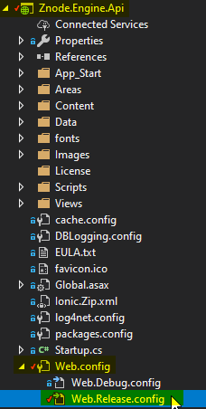

This example first walks through publishing the sites to simply run on localhost on the server. This means the only configuration values that need to be overridden are the DB connection strings. For example:

```
<add name="ZnodeECommerceDB" connectionString="Data Source=vm-sql-01;Initial Catalog=znode_931;User Id=sa;Password=myP@ssword;Column Encryption Setting=Enabled" providerName="System.Data.SqlClient" xdt:Transform="SetAttributes" xdt:Locator="Match(name)" />
<add name="Znode_Entities" connectionString="metadata=res://*/DataModel.ZnodeEntities.csdl|res://*/DataModel.ZnodeEntities.ssdl|res://*/DataModel.ZnodeEntities.msl;provider=System.Data.SqlClient;provider connection string=&quot;Data Source=vm-sql-01;Initial Catalog=znode_931;User Id=sa;Password=myP@ssword;MultipleActiveResultSets=True;App=EntityFramework&quot;" providerName="System.Data.EntityClient" xdt:Transform="SetAttributes" xdt:Locator="Match(name)" />
```

The `Data Source`, `Initial Catalog`, `User Id`, and `Password` all need to be properly filled in depending on the details of the DB to connect to.

These DB connection strings need to be added, and other overrides should be removed, resulting in something like the following:

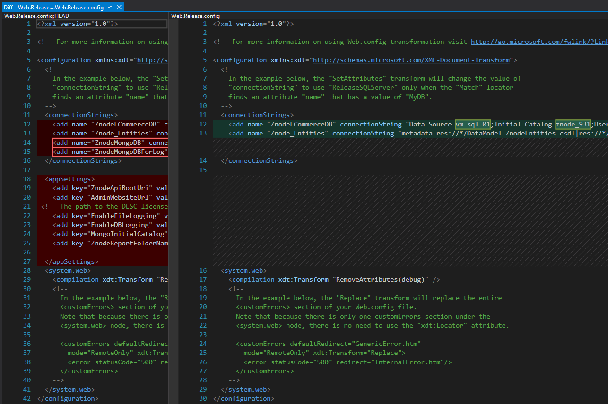

## Publish the Znode API

To publish a Znode install to IIS, it's best to start with the API. This is because the API can funciton on its own, and the other parts of Znode consume the API.

1. Create a publish profile for the `Znode.Engine.Api` project.


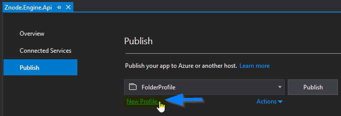

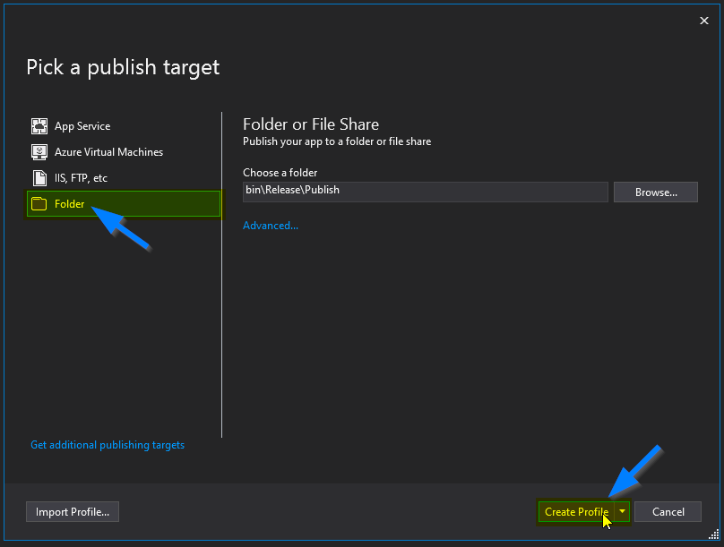

2. Build a published package.


2. ZIP the published package.

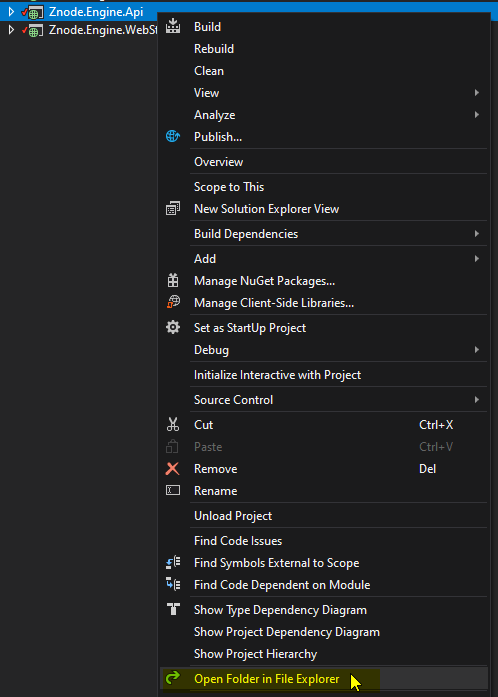

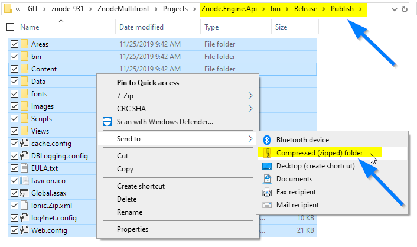

3. Copy the ZIP to the server.


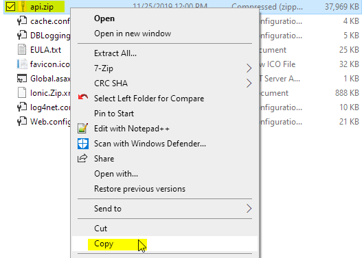

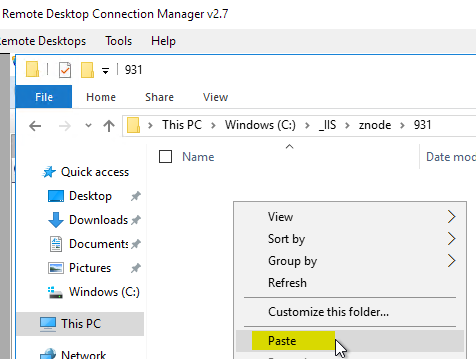

3. Un-ZIP the ZIP on the server.


## Create the API IIS Site

Once the publish package is on the server, a new IIS site must be created to host the package as a site. Note that creating an IIS site is only needed on initial deploy.

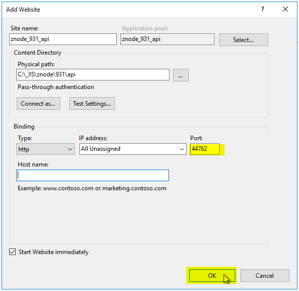

## Confirm the API IIS Site Runs

Now that the API site is created, open `localhost:44762` in a browser to confirm it loads.

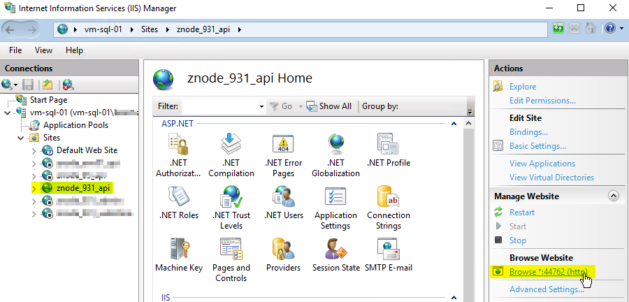


## Define Admin UI Config Transforms

With the API running, the next step is to repeat the same process to configure (and build and deploy) the Admin UI.

The Admin UI's Web.Release.config should be configured with any overrides applicable to the server environment. In this example, no overrides should be applied.

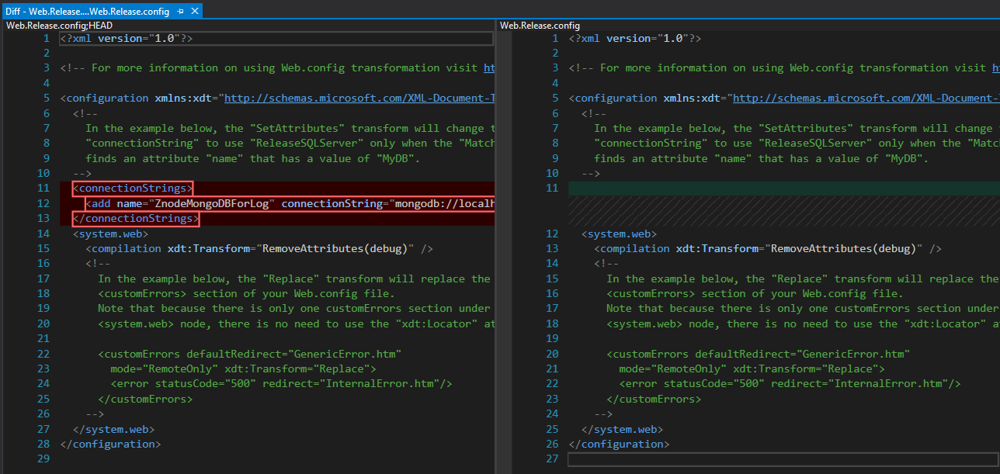

## Publish the Znode Admin UI

Repeat the same publish process, but for the `Znode.Engine.Admin` project.

## Create the Znode Admin UI IIS Site

Repeat the same process of creating a site, but for the Admin UI.

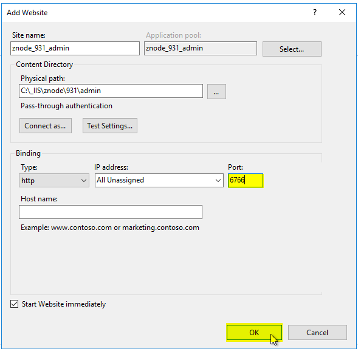

## Confirm the Admin UI IIS Site Runs

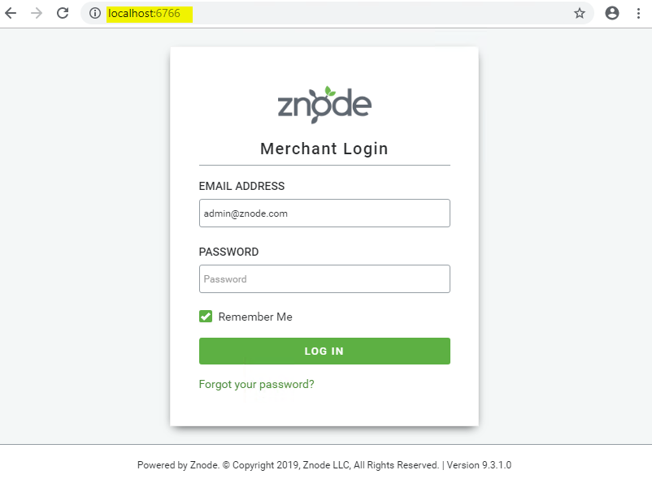

## Define WebStore UI Config Transforms

With the API and Admin UI running, the next step is to repeat the same process to configure (and build and deploy) the WebStore UI.

The WebStore UI's Web.Release.config should be configured with any overrides applicable to the server environment. In this example, no overrides should be applied.

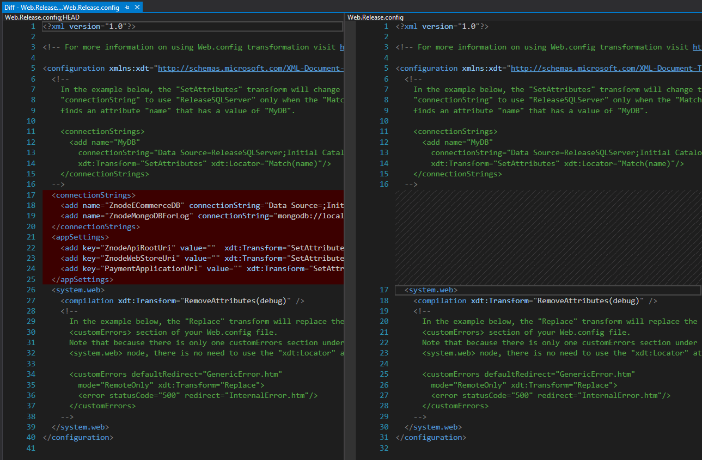

## Publish the WebStore UI

Repeat the same publish process, but for the `Znode.Engine.WebStore` project.

## Create the WebStore UI IIS Site

Repeat the same process of creating a site, but for the WebStore UI.

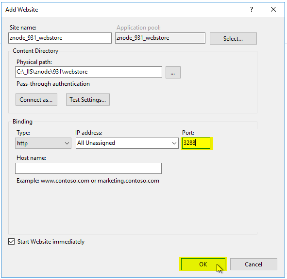

## Confirm the WebStore UI IIS Site Runs

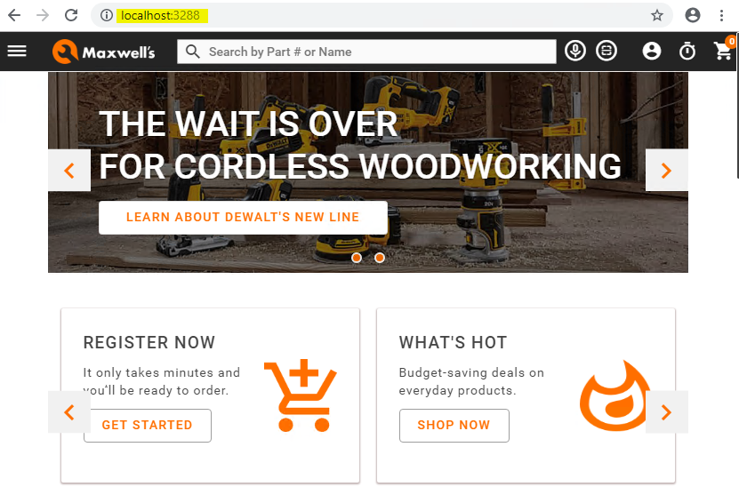

## Configure External (non-localhost) URL's

To expose the Znode install on external/public URL's:

1. Create the CNAME/A records with the domain registrar (eg: AWS, GoDaddy, etc.).
1. Configure Znode's DB with the URL domains.
  1. The `ZnodeDomain` table needs to have entries for each URL that the API, Admin, and WebStore are to be hosted on. These entries can be directly edited (eg: with SSMS), or, through the Admin UI itself:
    1. http://knowledgebase.znode.com/v9-3-1/index.php/Stores#URL_Tab
    1. http://knowledgebase.znode.com/v9-3-1/index.php/Global_Settings#URL_Management
1. Configure the Web.Release.config files with the public URL's.
1. Re-publish the store so that the media URL's update.

TODO - pic of webstore on public url