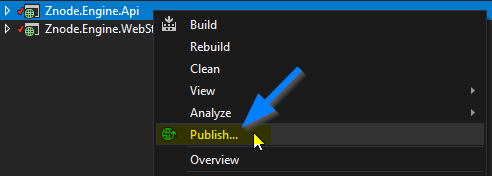

# Publishing with Visual Studio (Optional)

Visual Studio has a built in `Publish` functionality to help build, and optionally, deploy the application to a site on an IIS server. This document is not meant to teach how the Publish funtionality itself works, but rather, show how Znode can be published to folders, ZIP-ed, copied to a server, and un-ZIP-ed to IIS sites at a high level. A better long term solution would be to publish directly to a remote IIS server, or, setup a full CI/CD pipeline.

As mentioned, general .NET training is not within the scope of the Znode Docs. To learn more about Visual Studio's Publish feature in general, their [Publish Tutorial](https://docs.microsoft.com/en-us/visualstudio/deployment/tutorial-import-publish-settings-iis?view=vs-2019) may be a good place to start.

## Define API Config Transforms

TODO

## Publish the Znode API

To publish a Znode install to IIS, it's best to start with the API. This is because the API can funciton on its own, and the other parts of Znode consume the API.

1. Create a publish profile for the `Znode.Engine.Api` project.

2. Build a published package.

2. ZIP the published package.

## Create the API IIS Site

## Confirm the API IIS Site Runs

## Publish the Znode Admin UI

## Create the Znode Admin UI IIS Site

## Confirm the Admin UI IIS Site Runs

## Publish the Znode WebStore UI

## Create the Znode WebStore UI IIS Site

## Confirm the WebStore UI IIS Site Runs

## Configure External (non-localhost) URL's