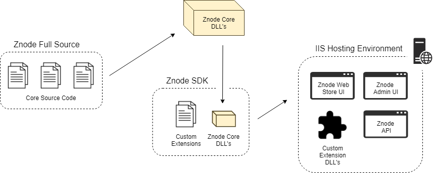

# SDK vs. Full Source Development

Znode is distributed in two formats, an SDK format, and a full source code format. This page describes the differences between the two formats to help a Znode developer decide which format is right for their use case.

## Reason for Availability of Two Formats

Znode is a large platform with lots of functionality that covers most stardard use cases encountered on eCommerce stores. At the same time, Znode can be easily extended with custom behavior to handle additional use cases.

Availability of the two formats offers the transparent debuggability of the full source code, while also enforcing clean implementation practices of custom functionality. This ensures easier upgrade paths to newer versions of Znode.

## Core Znode Libraries

Core Znode libraries are maintained within the full source code and then referenced from the SDK.

<a href="http://jgraph.github.io/drawio-github/edit-diagram.html?user=bsmith1310@gmail.com&org=amlacommerce&repo=znode-docs-test&path=docs/sdk-vs-full-source/_assets/sdk-overview.png" target="_blank">Edit</a>

Note that regardless of whether working with the full source code or the SDK, the output build artifacts have the same Znode application functionality. Subsequent sections in this document compare/contrast the two formats of Znode in more detail.

## SDK Format

One format in which Znode is distributed, is as an SDK, available in the [SDK respository](https://github.com/amlacommerce/znode).

The SDK [Visual Studio Solution](https://github.com/amlacommerce/znode/blob/master/ZnodeMultifront/Projects/Znode.Multifront.sln) contains ~15 projects. Many [core Znode libraries](/docs/core-znode-libraries/README.md) are pre-packaged as NuGet packages and referenced from this solution.

* **Do** use the SDK to implement all customizations for specific customers/implementations.
* **Don't** use the SDK to try to debug errors originating from the [core Znode libraries](/docs/core-znode-libraries/README.md).

## Full Source Code Format

The other format in which Znode is distributed, is as the full source code, available in the [full source code repository](https://github.com/amlacommerce/znode-source).

The full source code [Visual Studio Solution](https://github.com/amlacommerce/znode-source/blob/master/Projects/Znode.Multifront.sln) contains ~40 projects. There are more projects in this solution than the SDK solution due to the core Znode libraries' source code residing in the project as opposed to being published through NuGet.

* **Do** use the full source code if necessary to debug errors originating from the [core Znode libraries](/docs/core-znode-libraries/README.md).
* **Do** use the full source code to implement [potential fixes](/docs/submitting-pull-requests/README.md) for bugs or undesirable behavior found in the [core Znode libraries](/docs/core-znode-libraries/README.md).
* **Don't** use the full source code to implement any custom functionality for customers.

## Developing with Both Formats

When developing a Znode implementation for a customer, it is common to have both the SDK and full source code setup on the developer's machine.

Both Visual Studio solutions may be open simultaneously, but only one solution should be run at a time. To efficiently switch between solutions, the same key configuration settings can be mirrored between the two solutions so that Elasticsearch, MongoDB, and SQL databases are shared between both the SDK and Full Source solution.
